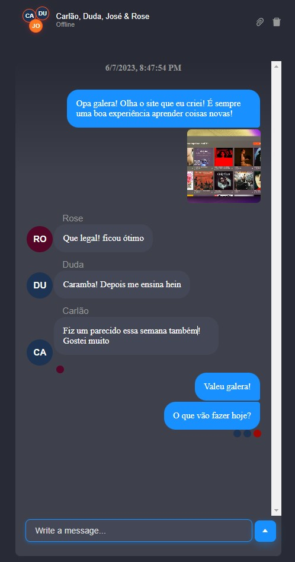
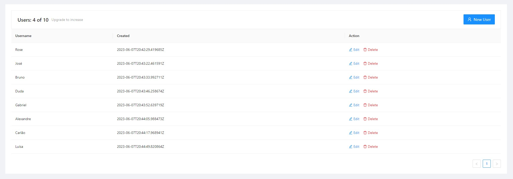

# Chat em Tempo Real com ChatEngine.io :computer: :iphone:

Este é um projeto de chat em tempo real desenvolvido com a API do ChatEngine.io, utilizando as tecnologias React + Vite e Node.js. O projeto permite que os usuários se conectem e troquem mensagens em tempo real em salas de chat.

## Funcionalidades

- Criação de salas de chat para conversas em grupo e 1 a 1.
- Envio e recebimento de mensagens e documentos em tempo real.
- Confirmação de visualização.
- Presença de usuários online em cada sala de chat.
- Histórico de mensagens para visualização posterior.
- Interface de usuário intuitiva e responsiva.

## Tecnologias Utilizadas

- React
- Node.js
- ChatEngine.io

## Capturas de Tela

_Figura 1: Sala de Chat_

_Figura 2: Sala de chat responsiva_

_Figura 3: Dashboard no site do ChatEngine em que é possível controlar os usuários_

## Documentação

Este projeto foi desenvolvido seguindo a documentação oficial do ChatEngine.io. Para obter mais informações sobre a API e como utilizá-la, consulte a documentação em [link para a documentação do ChatEngine.io](https://chatengine.io/docs/react/v1).

## Contato

Se você tiver alguma dúvida ou sugestão relacionada a este projeto, entre em contato comigo! Informações de contato disponíveis no meu perfil do GitHub.
